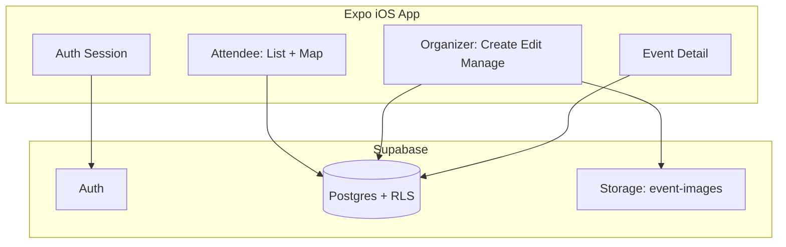

# Local Events App — Iterative Build Plan

**Locked decisions:** any-city GPS discovery · Organizer role required to publish · Expo 54 + Supabase · project dir `local-events` · **one Cursor session = one task** · **ask before next phase** · **Mac day-to-day preview = iOS Simulator**

**Added 2026-08-12:** recurring events are a **classification flag only** (`event_kind`), no recurrence rules or generated instances · **no Google Maps provider switch and no native dev build** — redirect to the user's own Maps app instead · social sign-in (Apple / Google) **deferred out of v1**, email auth stays · image moderation uses a **third-party moderation API**

**Added 2026-08-13:** Phase **7.4** auth UX (forgot password, duplicate-email handling, stronger passwords) · Phase **9.4** Free filter separated from category chips (Free still shows as price on cards)

**Product framing (v1):** One **iOS** app with Attendee and Organizer modes. Attendees browse nearby events; Organizers create and manage listings. Not kids-only. Not a macOS Catalyst / App Store Mac app in v1.

---

## Mac preview (no physical phone required)

| Method | What it is | When to use |
| --- | --- | --- |
| **iOS Simulator (preferred)** | Apple’s Simulator.app on macOS via Xcode | Day-to-day UI + most native APIs on this MacBook |
| **`expo run:ios`** | Compiles a native Debug app into Simulator (no Expo Go shell) | When you need custom native modules / closer to production binary |
| **Expo Go on a phone** | Optional | Quick check on a real device |
| **Web (`expo start --web`)** | Browser | Layout-only; **not** authoritative for location/maps |

**There is no first-class “Mac desktop native” target for this product.** The Mac-native path is **Simulator**, which runs the iOS app on the Mac.

### Commands (see also `docs/dev-preview.md`)

```sh
cd /Users/ayeshadadabhoy/Desktop/local-events

# Preferred: Metro + open iOS Simulator (Expo Go inside Simulator is fine for Phase 0–2)
npm run ios

# Optional: compile native iOS app into Simulator (requires CocoaPods + ios/ after prebuild)
npm run ios:native

# Layout-only fallback
npm run web
```

### One-time Mac setup

1. Xcode from the Mac App Store (already present on this machine: Xcode 26.x).
2. Install an **iOS Simulator runtime**: Xcode → Settings → Platforms → iOS, or:
   `xcodebuild -downloadPlatform iOS`
3. Create/boot a device if none exist (after runtime installs).
4. For `ios:native`: install CocoaPods (`brew install cocoapods` or `gem install cocoapods`), then `npm run ios:native`.

**Source of truth for task IDs:** [`PROGRESS.md`](./PROGRESS.md). This plan is architecture + queue.

---

## Project location and porting

| Item | Value |
|---|---|
| **App directory** | `/Users/ayeshadadabhoy/Desktop/local-events` |
| **Reference** | `/Users/ayeshadadabhoy/Desktop/playdates` — read-only |
| **Do not** | Modify `playdates` or treat it as the App Store target |

**Ported / adapted:** EventCard visual language; Expo 54 baseline; env-based Supabase (no hardcoded secrets).

---

## Multi-session protocol

1. One session = one task ID from `PROGRESS.md`.
2. Start: read `AGENTS.md` + `PROGRESS.md` + Expo v54 docs before native APIs.
3. End: update `PROGRESS.md` + `docs/session-log.md`, then STOP.
4. Phase complete → ask user before Phase N+1.
5. Prefer verifying UI on **iOS Simulator** when touching screens.

---

## Architecture (target)



**Stack:** Expo Router · Supabase Auth/DB/Storage/RLS · `react-native-maps` · `expo-location` · `expo-image-picker` · EAS · preview on **iOS Simulator**

---

## Status vs original plan

| Area | Status |
|---|---|
| Phase 0 — foundations | **done** |
| Phase 1 — auth, roles, account deletion | **done** |
| Phase 2 — attendee discovery (list, map, detail, share, filters) | **done** |
| Phase 3 — organizer supply (create, pin, cover upload, My Events) | **done** |
| Phase 4 — polish (timezones, past events, reports, deep links) | **done** |
| Phases 5–9 — new UI/feature block added 2026-08-12 | **next** (start at 5.1) |
| App Store work | Renumbered from Phase 5 to **Phase 10** |

---

## Session queue

Task IDs and live status: [`PROGRESS.md`](./PROGRESS.md).

### Phases 0–4 — **complete**

| Phase | Scope |
|---|---|
| **0** (0.1–0.6) | Foundations: scaffold, tokens, types, schema docs, location stub, shell screens |
| **1** (1.1–1.3) | Email auth + persistence; profile + Become Organizer + gated Create; account deletion |
| **2** (2.1–2.3) | Location + nearby list; map pins; event detail + share + light filters |
| **3** (3.1–3.4) | Create draft; map/location picker; cover upload; My Events edit/publish/cancel |
| **4** (4.1–4.3) | Timezone display + hide past; report / `is_hidden`; deep links |

### Phase 5 — Foundation

Schema changes land in one wave because nearly everything downstream depends on the new columns. Palette goes first so later screens are styled once, not twice.

| Task | Goal |
|---|---|
| **5.1** | Palette tokens + contrast pass; replace hardcoded hex and hash-based `PillColors` |
| **5.2** | One migration: `event_kind`, fixed category set, `organizer_url`, structured price, moderation columns + `pending_review`, `profiles.username` + `trust_level`; update types |
| **5.3** | Backfill + read-path compatibility: free-text categories, price labels, null venue/address |

### Phase 6 — Trust and safety

Before the UI multiplies, and before App Review sees it (Guideline 1.2 requires filtering, reporting, blocking, and a contact method).

| Task | Goal |
|---|---|
| **6.1** | Server-side text screening at publish (allow / flag / block) + `pending_review` + RLS |
| **6.2** | Image moderation on cover upload via Edge Function; fail closed if the vendor is down |
| **6.3** | Trust tiers + auto-approve timer so no organizer waits indefinitely |
| **6.4** | Review queue views in Supabase Studio + flag notification webhook |
| **6.5** | Report hardening: threshold before auto-hide, organizer notice + appeal, block organizer, support contact |
| **6.6** | Organizer realness: email confirmation, profile completeness gate, rate limits, duplicate detection |

### Phase 7 — Identity and profile

All JavaScript and Supabase config; no native build.

| Task | Goal |
|---|---|
| **7.1** | Branded auth emails (custom SMTP on own domain) — fixes "the code comes from Supabase" |
| **7.2** | Username selection: uniqueness, reserved list, profanity check, availability RPC, suggestion |
| **7.3** | Profile redesign; explicit guest-browsing copy; organizer badge; empty/error states |
| **7.4** | Auth UX: forgot/reset password via deep link; clearer duplicate-email handling; stronger password rules + copy |

Prefer **7.1** before or with **7.4** so reset emails are branded.

### Phase 8 — Maps and location

No native build; stays Expo Go compatible.

| Task | Goal |
|---|---|
| **8.1** | "Open in Maps" out-link: Google Maps scheme → HTTPS universal-link fallback; Google / Apple / copy-address sheet |
| **8.2** | Location search in create via the free `Location.geocodeAsync`; easier pin drop |
| **8.3** | Map tab polish with new palette + kind filtering |

### Phase 9 — Create and discover UX

| Task | Goal |
|---|---|
| **9.1** | Create restructure: cover first, all fields required except end time, date picker in a modal |
| **9.2** | Category dropdown, event kind dropdown, organizer link (https-only), structured price input |
| **9.3** | Discover: permanent vs pop-up tabs |
| **9.4** | Discover: filter/sort sheet (price, date, distance); Free filter UX — Free stays on cards as price, not in the category chip row; separate Free filter with category-style selected state; past-event logic excludes ongoing events |

### Phase 10 — App Store

| Task | Goal |
|---|---|
| **10.1** | EAS config + `ios.bundleIdentifier` + privacy usage strings |
| **10.2** | Legal URL placeholders; App Review demo notes; privacy labels (incl. moderation vendor) |
| **10.3** | TestFlight path; screenshot checklist (prefer Simulator screenshots) |

---

## Data model (v1)

**`profiles`:** `id`, `display_name`, `avatar_url`, `is_organizer`, `created_at`

**`events`:** `id`, `organizer_id`, `title`, `description`, `category`, `price_label`, `starts_at`, `ends_at`, `timezone`, `venue_name`, `address`, `lat`, `lng`, `status` (`draft` \| `published` \| `cancelled`), `cover_image_url`, `is_hidden`, `created_at`, `updated_at`

**`event_images`:** `id`, `event_id`, `url`, `sort_order`

**RLS:** public read published+not hidden+not cancelled; organizer insert only if `is_organizer`; owner update/delete; drafts owner-only; storage path-scoped writes.

SQL: `supabase/migrations/` · apply guide: `docs/supabase-setup.md`

---

## Out of scope for v1

Ticket checkout · attendee chat · **recurrence rules / generated event instances** (the permanent-vs-pop-up split is a classification flag only) · admin web · Android store listing · push · social sign-in · in-app Google Maps provider · **macOS App Store / Catalyst desktop app**

---

## Success criteria for MVP

Sign up (Simulator) → nearby list + map → detail; become Organizer → publish with photo/time/pin; owner-only edit/cancel; EAS/TestFlight path documented; privacy + account deletion + report present.
